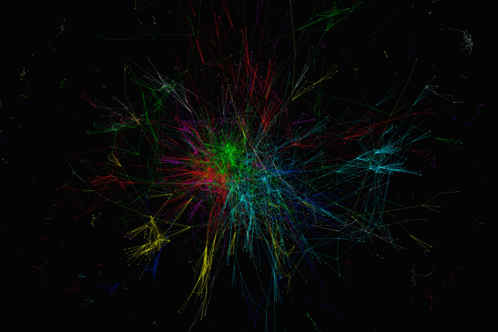

(obligatory network visualization)
 
 
 

## Instructor

**Name:** [Chris Bail](www.chrisbail.net)  
**Email:** christopher.bail@duke.edu  
**Office Hours:** TBD 
**Github:** https://github.com/cbail  
**Slack Channel:** https://dukemids.slack.com/archives/CRSPSGFHR  

## COVID-19 ANNOUNCEMENT

The worldwide spread of COVID-19 has impacted all of us. Many of us are dealing with unprecedented challenges that have stretched us to our limits. I am working hard to adapt our class to these challenging circumstances but will need to ask for your patience as I continue to assess how to best serve everyone's needs in a rapidly changing environment. Below is my first effort to outline a path forward for us, but I am very open to feedback from you and may make additional changes in accordance with your needs or requests.

***Remote Learning***

Thank you all for completing the anonymous survey I distributed about your current situation. This has been enormously helpful as I try to chart the best path forward for our class. Unfortunately, this survey revealed that some people in our class do not have regular access to high quality internet right now, which means at least some people will not be able to participate in classes in real time. To accommodate these people, I am going to distribute links to recordings of each Zoom session in our course's slack channel for the remainder of the session.  We will hold class at our regularly scheduled times. For those of you who are not able to join live, I will be very happy to answer any questions you have by slack at a later point in time.  

***Course Requirements***

As you may have heard by now, Duke University has decided to make all classes graded as "Satisfactory" or "Unsatisfactory" unless you request a letter grade. You will receive a "Satisfactory" grade as long as you achieve more than a 70 (or C-) in our class. In general, I hope this decision will give you the flexibility you need to achieve at a high level in our class. Our move to remote learning does pose significant challenges to the main course requirement in our class: our group projects. When we meet on Tuesday, I am going to discuss a path forward for this course requirement, which will likely involve reassessing what is possible via remoate interaction. I am also hoping that we can try to find some positive energy, however, and perhaps do some work together that might help societal response to COVID-19. For now, we will proceed with our original grading plan for the group project (see grade calculations below). We will also continue with weekly labs, but I am going to make these optional for the rest of the semester. If you do not complete any additional labs, your grade for the semester will be the average grade you have received on the labs before spring break.

***Other Forms of Support***

If you require support- whether it is health care, mental health care, or financial support- Duke has created a single website where updates are being posted about the university's response and other resources that are available to you as a member of the Duke community, I urge you to visit https://coronavirus.duke.edu/ regularly to take advantage of the information posted there each day.

## Course Description

Welcome to "Data Scraping and Text Analysis" (IDS 703), one of the core courses in [Duke University's Masters Program in Interdisciplinary Data Science (MIDS)](https://datascience.duke.edu/). The past decade has witnessed an explosion of data produced by websites such as Twitter, Facebook, Google, and Wikipedia, but also the mass digitization of historical archives and administrative records. Though these new data sources hold enormous potential to address a range of pressing problems within industry and academia, collecting and analyzing text-based data presents unique challenges. Fortunately, the widespread availability of text-based data coincides with major advances in the fields of computer science and natural language processing. This course will provide students with an overview of popular techniques for collecting, processing, and analyzing text-based data—including screen-scraping, mining data from application programming interfaces or APIs, topic modeling, text networks, and advanced text classifiers. We will also discuss the challenge of conducting empirical research with these data, including ethics, causal inference, and the external validity of digital sources.

## Prerequisites

R will be the main programming language for this course. Though the class will review basic programming techniques such as loops and functions, practical experiences with R is highly recommended. The majority of our time will be spent mastering the following R packages: `rvest`, `rtweet`, `lda`, `stm`, `ldaviz`, `textnets`, and `wordVectors` as well as a variety of functions in base R. General knowledge of data structures, basic programming, and rudimentary statistics is also required.

## Readings

[Salganik, Matthew. *Bit by Bit: Social Research in the Digital Age.* Princeton: Princeton University Press](https://press.princeton.edu/books/ebook/9781400888184/bit-by-bit)

[Nicholas Cristakis & James Fowler. *Connected: The Surprising Power of Our Social Networks and How they Shape Our Lives*, Hachette](http://www.connectedthebook.com/)  

All other readings are linked under course material as indicated in the course schedule below.

## Requirements

Success in this course requires that you attend class, complete requisite readings before class, complete weekly homework assignments, complete a mid-term exam, and develop a final group project with several of your classmates. I describe each of these requirements in the following sections.

#### Readings

You must complete all readings prior to class and come to our meetings prepared to discuss them.

#### Labs

Weekly homework exercises or "labs" are linked in the course schedule below and are designed to gauge your knowledge of the material presented during that week. Each lab is designed to correspond with a major course topic, which will be indicated in the lab title. Each lab will be posted at least one week prior to its due date so that it is available for students at the start of the first lecture covering that topic and is due via [Dropbox](https://sakai.duke.edu/portal/site/6f22e36f-1583-4afe-a6e0-ad75fb2229b9/tool-reset/4049fefe-3ba1-43e8-9cba-a92758c96655) after the second lecture on the topic, prior to the next scheduled lecture's start. For example, Lab 1 which covers material presented on APIs (January 21 and 23) will be posted by the start of class, January 21, and will be due via Dropbox prior to January 28's lecture.

#### Mid-Term Exam

The mid-term exam will include approximately 20 multiple choice and short answer questions that cover content from the first half of the class.

#### Final Project

The final project will be a team-based research project that fuses all of the skills we learn during the course of the semester in order to answer a question that can be solved with text-based data. All projects must analyze at least 1,000 documents and apply some type of automated text analysis to identify meaningful patterns within them and address an empirical question of interest to data scientists, broadly defined. Examples might include a sentiment analysis of a company’s tweets and responses to those tweets in order to measure customer satisfaction, or an analysis that seeks to determine why posts on Facebook fan pages go viral.

Each team must produce a 20-minute presentation that describes their research project, delivered in powerpoint or another medium during a final class period and delivered to the instructor before this time. Each team must also submit a report that details their work and what type of work each student contributed to the project (i.e which team members contributed to which part of the project and precisely what work each team member did)– your goal should be for all members of the team to contribute to each stage of the project. As an additional accountability mechanism, ⅓ of your grade for the final project will be determined by your fellow group members, with the remaining ⅔ of your grade for the project determined by Professor Bail (and this part of the grade will be assigned to the entire team, instead of by individual members).

#### Participation

Attendance in this course is mandatory and you are expected to be an active participant in all classroom discussions and exercises. If you suffer from social anxiety or if English is not your first language, I encourage to participate in discussions outside of class on our Slack Channel. Uncivil behavior such as engaging in personal conversations during lectures or discussion sections, browsing internet sites not relevant to classroom discussions, and cell phone usage will negatively affect your grade. Your participation grade will be calculated at the end of the semester, but if you would like to receive input on your participation grade at any point during the semester please contact me.

#### Grading Scheme

Labs: 30%

Mid-Term Exam: 30%

Final Project: 30% (⅓ of this grade is determined by your fellow group members and ⅔ is determined by Professor Bail)

Participation: 10%

## General Course Policies

I am a very reasonable person and understand that sometimes “life happens” and you may not be able to complete your work in a timely manner. I will therefore carefully consider all explanations for deviance from the general course policies outlined below.

#### Attendance

Attendance for all lectures is mandatory. If you have a University-excused reason to miss please follow the proper procedure for letting your TA know about it. You are responsible for knowing and acting in accordance with University policy.

#### Academic Integrity

Understand and follow the Duke Community Standard. Plagiarism, cheating or other violations will be dealt with according to University policy. All student assignments will be processed by plagiarism detection software.

#### Mental Health and Stress

If you are suffering from stress, depression, anxiety, or any other mental health issues that are common among Duke students, please consider visiting Counseling and Psychological Services (CAPS) on campus, who provide support on everything from minor to major mental health issues.

[Duke Reach](https://studentaffairs.duke.edu/dukereach1) - ( [email](dukereach@duke.edu) ) serves to direct students and faculty alike to resources that can help them during their times of need. These resources include the Student Behavioral Assessment team, the Duke Wellness Center, and many more resources.

#### Extra-Credit Policy

There will be no extra credit or make-up assignments. 

#### Syllabus
  
I reserve the right to make changes to the syllabus, including project due dates and test dates. These changes will be announced as early as possible and no later than one week before materials are due.

#### Help Us Make This Course Better

Creating high quality teaching materials is hard work! If you ever discover any errors or inconsistencies in the teaching materials on this site, please email one of the teaching assistants and cc me.

## Resources

Below I have listed several resources which I hope might be helpful to you for this course and beyond (particularly if you want to pursue the study of text as data after this class).

#### RStudio Tutorials

In this class, we will use the R software, which is free and open-source. There are a variety of different ways to use R, but the most common way to do so is with the software RStudio, a free Graphical User Interface which you can either run on your laptop, or via a web server. R and RStudio are both supported by a vibrant community of individuals who have created a treasure-trove of learning resources online. [Here is a link](https://education.rstudio.com/) to some very helpful beginner tutorials, and this link also includes some intermediate and advanced tutorials if you really want to challenge yourself.

#### The Summer Institutes in Computational Social Science (SICSS)

I am the co-founder of the Summer Institutes in Computational Social Science. These annual events are designed to introduce PhD students and other young faculty members to the field in dozens of places around the globe. Though masters-level students are not currently invited to attend the events, my co-founder and I have created an [extensive website](https://compsocialscience.github.io/summer-institute/curriculum) that includes links to videos of lectures that he and I give on a range of topics, as well as talks by some of the most renowned scholars in the field, employees of large companies interested in the field such as Facebook, and others who work in non-profits or government. If you find this class interesting or exciting, you may wish to check out some of the videos from these speakers to get a sense of the full-array of work going on in our field.

#### Stack Overflow

The field of computational social science is growing so rapidly that none of the resources I give you will remain at the cutting edge for long. You will almost certainly encounter issues unique to the data we collect as part of our group research project and/or incompatibilities between software packages and/or your computer. Stack Overflow is a website where computer programmers help each other solve such problems. Individuals ask questions, and others earn “reputation points” for solving their problems—these reputation points are awarded by the person who asks the question as well as other site users who vote upon the elegance/efficiency of each solution. For you, this reputation system means you can quickly identify the most high-quality solutions to your problems.

#### Twitter/Blogs

Many of the most important advances in computational social science appear first on Twitter or blogs. I therefore encourage you to open a Twitter account- if you don’t already have one- and follow the authors we read, or consider checking out [the people I follow](https://twitter.com/chris_bail/following). Having a Twitter account will also come in handy for some of the exercises we do in class to collect data from Twitter. Of the many blogs that you might read, I recommend [R Bloggers](https://www.r-bloggers.com/), which provides a concise overview of new functions in R as well as solutions to common problems faced by computational social scientists, as well as those in other fields.

## Course Schedule (Spring 2021)

We meet every Tuesday and Thursday unless otherwise noted. Readings must be completed before each class where they appear on the schedule below. Lab assignments are linked below immediately prior to the date they are open (note that each lab's due date is listed below as well as on the lab page). Links to my presentation slides and annotated code relevant to each lecture are below as well.

### **Introduction**
#### January 24-30

<iframe width="560" height="315" src="https://www.youtube.com/embed/zGG9wPl1C5E" frameborder="0" allow="accelerometer; autoplay; clipboard-write; encrypted-media; gyroscope; picture-in-picture" allowfullscreen></iframe>

<iframe width="560" height="315" src="https://www.youtube.com/embed/uuSWQN7uYhk" frameborder="0" allow="accelerometer; autoplay; clipboard-write; encrypted-media; gyroscope; picture-in-picture" allowfullscreen></iframe>

<iframe width="560" height="315" src="https://www.youtube.com/embed/b8XTtBnENfo" frameborder="0" allow="accelerometer; autoplay; clipboard-write; encrypted-media; gyroscope; picture-in-picture" allowfullscreen></iframe>
 

***Required reading***:  
- Salganik, Matthew, *Bit by Bit*, [Introduction](https://www.bitbybitbook.com/en/1st-ed/introduction/) & [Observing Behavior](https://www.bitbybitbook.com/en/1st-ed/observing-behavior/)  
-Lazer et al. [Computational social science: Obstacles and opportunities](https://science.sciencemag.org/content/369/6507/1060.summary), *Science*.
 

***Suggested reading***:  
- Lazer et al. [Computational Social Science](https://science.sciencemag.org/content/323/5915/721), *Science*.  
- Lazer et al. [Life in the network: the coming age of computational social science](https://www.ncbi.nlm.nih.gov/pmc/articles/PMC2745217/), *Science*.  
- Watts, Duncan. [Should social science be more solution-oriented?](https://www.nature.com/articles/s41562-016-0015), *Nature*
- Blumenstock et al. [Predicting Poverty and Wealth from Mobile Phone Data](https://science.sciencemag.org/content/350/6264/1073), *Science*.
- David Donoho. [50 Years of Data Science](https://courses.csail.mit.edu/18.337/2015/docs/50YearsDataScience.pdf)  
 
 
 
 

### **Ethics**
#### January 31-February 6 

<iframe width="560" height="315" src="https://www.youtube.com/embed/A-5QaX5ZiK8" frameborder="0" allow="accelerometer; autoplay; clipboard-write; encrypted-media; gyroscope; picture-in-picture" allowfullscreen></iframe>

<iframe width="560" height="315" src="https://www.youtube.com/embed/TT6dOQMKHhA" frameborder="0" allow="accelerometer; autoplay; clipboard-write; encrypted-media; gyroscope; picture-in-picture" allowfullscreen></iframe>

<iframe width="560" height="315" src="https://www.youtube.com/embed/lJyK6kXeDbc" frameborder="0" allow="accelerometer; autoplay; clipboard-write; encrypted-media; gyroscope; picture-in-picture" allowfullscreen></iframe>

***Required reading***:  
- Salganik, Matthew, *Bit by Bit*, [Ethics](https://www.bitbybitbook.com/en/1st-ed/ethics/) 
- Adam Kramer, Jamie Guillory, & Jeffrey Hancock. [Emotional Contagion](https://www.pnas.org/content/111/24/8788), PNAS.

***Suggested reading***:  
- Robinson Meyer. [Everything We Know About Facebook's Secret Mood Manipulation Experiment](https://www.theatlantic.com/technology/archive/2014/06/everything-we-know-about-facebooks-secret-mood-manipulation-experiment/373648/), *the Atlantic*.

### **Application Programming Interfaces**
#### February 14- February 20

<iframe width="560" height="315" src="https://www.youtube.com/embed/jde_c7pB5U8" frameborder="0" allow="accelerometer; autoplay; clipboard-write; encrypted-media; gyroscope; picture-in-picture" allowfullscreen></iframe>

### **Screen Scraping**
#### February 21- February 27

<iframe width="560" height="315" src="https://www.youtube.com/embed/LjTZNmBjC5Q" frameborder="0" allow="accelerometer; autoplay; clipboard-write; encrypted-media; gyroscope; picture-in-picture" allowfullscreen></iframe>

### **An Introduction to Text Analysis**
#### February 28- March 6

<iframe width="560" height="315" src="https://www.youtube.com/embed/pLsC4UyzX_U" frameborder="0" allow="accelerometer; autoplay; clipboard-write; encrypted-media; gyroscope; picture-in-picture" allowfullscreen></iframe>

<iframe width="560" height="315" src="https://www.youtube.com/embed/TAlO-5NJB7I" frameborder="0" allow="accelerometer; autoplay; clipboard-write; encrypted-media; gyroscope; picture-in-picture" allowfullscreen></iframe>

<iframe width="560" height="315" src="https://www.youtube.com/embed/wSIi2ZRKjaE" frameborder="0" allow="accelerometer; autoplay; clipboard-write; encrypted-media; gyroscope; picture-in-picture" allowfullscreen></iframe>

***Required reading***:  
- Justin Grimmer & Brandon Stewart. [Text as Data: The Promises and Pitfalls of Automated Content Analysis](https://www.cambridge.org/core/journals/political-analysis/article/text-as-data-the-promise-and-pitfalls-of-automatic-content-analysis-methods-for-political-texts/F7AAC8B2909441603FEB25C156448F20), Political Analysis. 
- James Evans & Pedro Aceves. [Machine Translation: Mining Text for Social Theory](https://www.annualreviews.org/doi/abs/10.1146/annurev-soc-081715-074206). Annual Review of Sociology.  

***Suggested reading***:  
 
- Bo Pang, Lillian Lee, & Shivakumar Vaithyanathan. [Thumbs up: Sentiment Classification using Machine Learning Techniques](https://www.aclweb.org/anthology/W02-1011/).    
- Kathleen Carley. [Extracting Culture Through Textual Analysis](https://www.sciencedirect.com/science/article/abs/pii/0304422X94900116). Poetics, 22:291-312.  

### **Topic Models**
#### March 7- March 13

<iframe width="560" height="315" src="https://www.youtube.com/embed/IUAHUEy1V0Q" frameborder="0" allow="accelerometer; autoplay; clipboard-write; encrypted-media; gyroscope; picture-in-picture" allowfullscreen></iframe>

***Required reading***:  
- Blei, David M. 2012. Probabilistic Topic Models. Communications of the ACM (Note: this is a challenging article, so don’t worry if you are not able to understand every last part).

### **Text Networks**
#### March 14- March 20 

<iframe width="560" height="315" src="https://www.youtube.com/embed/-2dBI2ULcQw" frameborder="0" allow="accelerometer; autoplay; clipboard-write; encrypted-media; gyroscope; picture-in-picture" allowfullscreen></iframe>

### **Surveys in the Digital Age**
#### March 21- March 27 

<iframe width="560" height="315" src="https://www.youtube.com/embed/j8fJGV17Hcg" frameborder="0" allow="accelerometer; autoplay; clipboard-write; encrypted-media; gyroscope; picture-in-picture" allowfullscreen></iframe>

<iframe width="560" height="315" src="https://www.youtube.com/embed/SLAi9v5CCnM" frameborder="0" allow="accelerometer; autoplay; clipboard-write; encrypted-media; gyroscope; picture-in-picture" allowfullscreen></iframe>

<iframe width="560" height="315" src="https://www.youtube.com/embed/HT1bQ3Bh79w" frameborder="0" allow="accelerometer; autoplay; clipboard-write; encrypted-media; gyroscope; picture-in-picture" allowfullscreen></iframe>

<iframe width="560" height="315" src="https://www.youtube.com/embed/_vecQs7aB6o" frameborder="0" allow="accelerometer; autoplay; clipboard-write; encrypted-media; gyroscope; picture-in-picture" allowfullscreen></iframe>

<iframe width="560" height="315" src="https://www.youtube.com/embed/97gahprIIOI" frameborder="0" allow="accelerometer; autoplay; clipboard-write; encrypted-media; gyroscope; picture-in-picture" allowfullscreen></iframe>

### **Online Experiments**
#### March 28- April 3

<iframe width="560" height="315" src="https://www.youtube.com/embed/hKiKiWbeD6I" frameborder="0" allow="accelerometer; autoplay; clipboard-write; encrypted-media; gyroscope; picture-in-picture" allowfullscreen></iframe>

<iframe width="560" height="315" src="https://www.youtube.com/embed/cYyu5Ex0twE" frameborder="0" allow="accelerometer; autoplay; clipboard-write; encrypted-media; gyroscope; picture-in-picture" allowfullscreen></iframe>

<iframe width="560" height="315" src="https://www.youtube.com/embed/KDLFigGDORY" frameborder="0" allow="accelerometer; autoplay; clipboard-write; encrypted-media; gyroscope; picture-in-picture" allowfullscreen></iframe>

<iframe width="560" height="315" src="https://www.youtube.com/embed/rAGMpZuU3RU" frameborder="0" allow="accelerometer; autoplay; clipboard-write; encrypted-media; gyroscope; picture-in-picture" allowfullscreen></iframe>

<iframe width="560" height="315" src="https://www.youtube.com/embed/aQPce-WgJBY" frameborder="0" allow="accelerometer; autoplay; clipboard-write; encrypted-media; gyroscope; picture-in-picture" allowfullscreen></iframe>

### **Building Apps**
#### April 4- April 10

<iframe width="560" height="315" src="https://www.youtube.com/embed/3wjYcIOpBgU" frameborder="0" allow="accelerometer; autoplay; clipboard-write; encrypted-media; gyroscope; picture-in-picture" allowfullscreen></iframe>

### **Wellness Week**
#### April 11- April 17

### **Chat Bots**
#### April 18- April 24

### **Presentations?**
#### April 25- May 1

